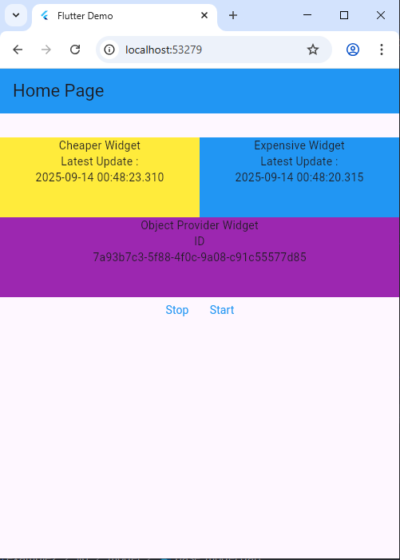

# Flutter Provider Example

This project demonstrates the use of Flutter's Provider package for state management, focusing on efficient widget rebuilding using `context.select()` and managing periodic updates with StreamSubscription.

## About Provider

Provider is a wrapper around InheritedWidget to make them easier to use and more reusable. It's one of the most popular state management solutions in Flutter because it:

- **Simplifies state management** - No need to manually handle InheritedWidget complexity
- **Provides dependency injection** - Easy to provide and consume objects across the widget tree
- **Supports multiple patterns** - ChangeNotifier, Stream, Future, and more
- **Optimizes rebuilds** - Only rebuilds widgets that actually need updates
- **Type-safe** - Full type safety with compile-time checks

## App Screenshot



*The app displays three widgets: CheaperWidget (yellow, updates every 1s), ExpensiveWidget (blue, updates every 10s), and ObjectProviderWidget (purple, shows provider ID)*

## StreamSubscription in Provider

This example demonstrates how to manage periodic data updates using StreamSubscription within a ChangeNotifier:

```dart
class ObjectModelProvider extends ChangeNotifier {
  late StreamSubscription cheaperModelSubscription;
  late StreamSubscription expensiveModelSubscription;

  void start() {
    // Updates cheaper model every 1 second
    cheaperModelSubscription = Stream.periodic(const Duration(seconds: 1))
        .listen((event) {
      cheaperModel = CheaperModel();
      notifyListeners();
    });

    // Updates expensive model every 10 seconds
    expensiveModelSubscription = Stream.periodic(const Duration(seconds: 10))
        .listen((event) {
      expensiveModel = ExpensiveModel();
      notifyListeners();
    });
  }

  void stop() {
    cheaperModelSubscription.cancel();
    expensiveModelSubscription.cancel();
  }
}
```

### Key Benefits of StreamSubscription in Provider:

1. **Controlled Updates** - You can start/stop updates as needed
2. **Multiple Update Frequencies** - Different data can update at different intervals
3. **Resource Management** - Proper cleanup prevents memory leaks
4. **Separation of Concerns** - Business logic stays in the provider

## Context.select() - Optimized Widget Rebuilds

The `context.select()` method is crucial for performance optimization. It allows widgets to listen only to specific parts of the provider state:

### Without select() (Inefficient)
```dart
// This rebuilds whenever ANY part of ObjectModelProvider changes
final provider = context.watch<ObjectModelProvider>();
final cheaperModel = provider.cheaperModel;
```

### With select() (Efficient)
```dart
// This ONLY rebuilds when cheaperModel specifically changes
final cheaperModel = context.select<ObjectModelProvider, CheaperModel>(
    (provider) => provider.cheaperModel
);
```

## Project Structure

```
lib/
├── main.dart                          # App entry point with ChangeNotifierProvider
├── model/
│   ├── base_model.dart               # Base model classes with UUID and timestamp
│   └── object_model_provider.dart    # Main provider with StreamSubscription logic
├── pages/
│   └── home_page.dart               # Main page layout
└── widgets/
    ├── cheaper_widget.dart          # Widget that updates every 1 second
    ├── expensive_widget.dart        # Widget that updates every 10 seconds
    ├── object_provider_widget.dart  # Widget showing provider ID
    └── text_button_widget.dart     # Reusable button component
```

## How It Works

### 1. Provider Setup
The app uses `ChangeNotifierProvider` at the root level:

```dart
ChangeNotifierProvider(
  create: (context) => ObjectModelProvider()..start(),
  child: MaterialApp(...)
)
```

### 2. Efficient Widget Updates
Each widget uses `context.select()` to listen only to the data it needs:

- **CheaperWidget** - Only rebuilds when `cheaperModel` changes (every 1s)
- **ExpensiveWidget** - Only rebuilds when `expensiveModel` changes (every 10s)
- **ObjectProviderWidget** - Rebuilds when any provider change occurs (uses `watch()`)

### 3. Performance Demonstration
This setup demonstrates that:
- CheaperWidget rebuilds 10 times while ExpensiveWidget rebuilds once
- Using `select()` prevents unnecessary rebuilds
- Each widget maintains its own update cycle efficiently

## Key Concepts Demonstrated

### 1. ChangeNotifier Pattern
```dart
class ObjectModelProvider extends ChangeNotifier {
  // State management with automatic widget notification
  void updateData() {
    // Update data
    notifyListeners(); // Triggers widget rebuilds
  }
}
```

### 2. Selective Listening
```dart
// Type-safe selection of specific provider data
final specificData = context.select<ProviderType, DataType>(
    (provider) => provider.specificProperty
);
```

### 3. Provider Access Patterns
```dart
// For reading data and listening to changes
context.watch<ObjectModelProvider>()

// For reading data without listening to changes
context.read<ObjectModelProvider>()

// For selecting specific data and listening only to those changes
context.select<ObjectModelProvider, SpecificType>(selector)
```

## Running the App

1. Ensure you have Flutter installed
2. Clone this repository
3. Run `flutter pub get` to install dependencies
4. Run `flutter run` to start the app

### Dependencies
```yaml
dependencies:
  flutter:
    sdk: flutter
  provider: ^6.0.0
  uuid: ^3.0.0
```

## Best Practices Demonstrated

1. **Use select() for Performance** - Only rebuild when specific data changes
2. **Proper Resource Management** - Cancel StreamSubscriptions to prevent memory leaks  
3. **Separation of Concerns** - Keep business logic in providers, UI logic in widgets
4. **Type Safety** - Use generic types for compile-time safety
5. **Immutable State Updates** - Create new objects instead of modifying existing ones

## Learning Outcomes

After studying this example, you'll understand:
- How to set up and use Provider for state management
- The importance of `context.select()` for performance optimization
- How to manage asynchronous operations with StreamSubscription
- Best practices for structuring Provider-based Flutter applications
- The difference between `watch()`, `read()`, and `select()` methods

This example serves as a foundation for building more complex Flutter applications with efficient state management and optimal performance.
